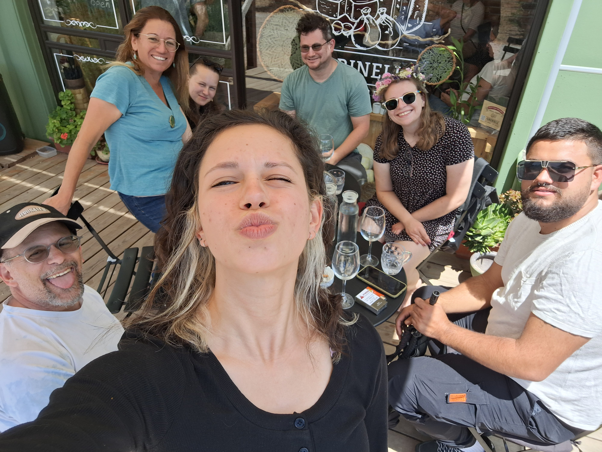

# **_Welcome to my webpage_**

The Brody family <3
## 🐳 About me 🐳
* Currently persuing my MSc, in the lab of [Dvir Gur](https://www.weizmann.ac.il/molgen/Gur/home), where we explore the pigment cells and the mechanisms of biological crystallization
* Animal lover (proud dog momma)
* Undergraduate in Animal Science and Biotechnology from Huji 
* Doing my Masters cuz I ~~dont want to be an adult yet~~ love research :)

##  🐧 Contact me via 🐧
📧__ruchama.brody@weizmann.ac.il__

🔗 [Linkedin](https://il.linkedin.com/in/romi-brody)

## 🦥 Links 🦥
1. [Mr. Szabó's home page](https://szabgab.com/)
1. [Weizmann Institute of Science](https://www.weizmann.ac.il/pages/)
1. [GitHub Profile](https://github.com/romizb)

  
